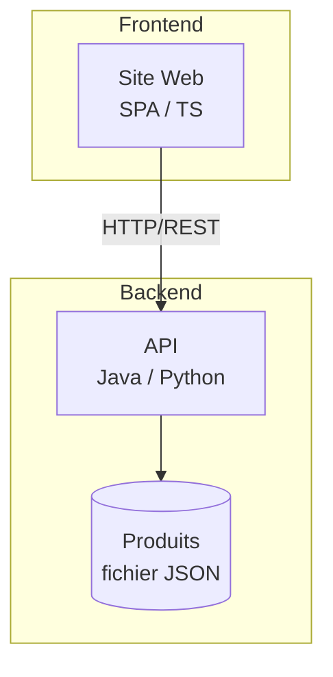

# Spécification Technique Générale

## 1. Architecture générale

- Application web de type SPA consommant une API REST.
- Frontend en SPA / Typescript ; React, Angular ou Vue.
- Backend en Java ou Python.
- Communication Front . Back via HTTP/REST.
- Les données produits sont lues depuis un fichier JSON côté backend.

## 2. Frontend

- Framework : un frameworkf front au choix.
- Langage : TypeScript.
- Type d’application : Single Page Application (SPA).
- Accessibilité : respect des exigences d’accessibilité via l’utilisation des attributs ARIA (labels et rôles appropriés).

## 3. Backend

- Langage : Java ou Python.
- Framework : Au choix en fonction du langage. Choisir un framework le plus simple possible.
- API REST exposée avec deux endpoints suivants 
  - `GET /products` 
  - `GET /product/<id>`
- Source de données : fichier JSON contenant les données de test des produits, stocké sur le backend.

## 4. Stratégie de tests

- Tests unitaires frontend et backend avec un objectif de couverture minimale de 70 %.
- Tests de bout en bout (E2E) sur les endpoints REST exposés par le backend.

## 5. Déploiement

- Frontend et backend packagés et exécutés via Docker.