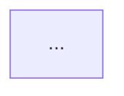

# TEMPLATE – Analyse Fonctionnelle Approfondie d’un Périmètre

# 1. Description générale du périmètre

# 2. Fonctionnalités détaillées
| Fonctionnalité | Description | Utilisateurs | Écrans | Flux API | Règles de gestion | Source |
|----------------|-------------|--------------|--------|----------|-------------------|--------|

# 3. Règles de gestion
| Règle | Description | Condition | Conséquence | Source |
|-------|-------------|-----------|-------------|--------|

# 4. Écrans et navigation
| Écran | Description | Champs/Widgets | Actions utilisateur | Navigation | Règles d’affichage | Source |

### Diagramme de navigation


# 5. Parcours utilisateur détaillés
### Parcours principal
### Parcours alternatifs
### Parcours d’erreur

### Diagramme de séquence
```mermaid
sequenceDiagram
   ...
```

# 6. Modèle de données du périmètre
- Champs
- Types
- Statuts
- Transitions autorisées

# 8. Hypothèses
- Hypothèse
- Source, indice
- Impact sur l'analyse

# 7. Points d’attention / dette fonctionnelle
- Incohérences
- Règles implicites
- Cas limites
- Risques